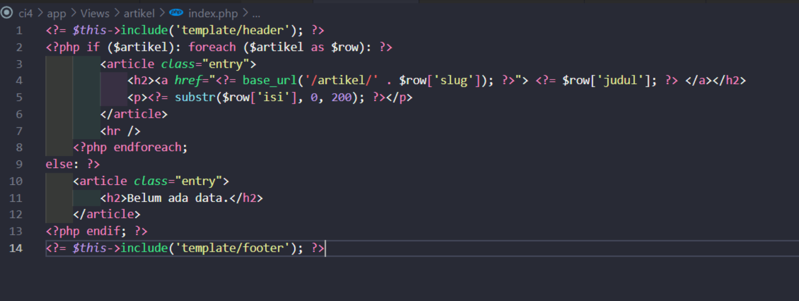
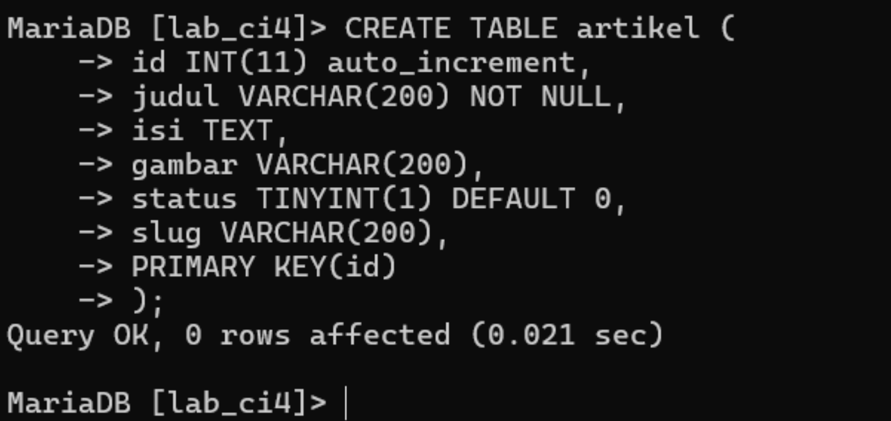
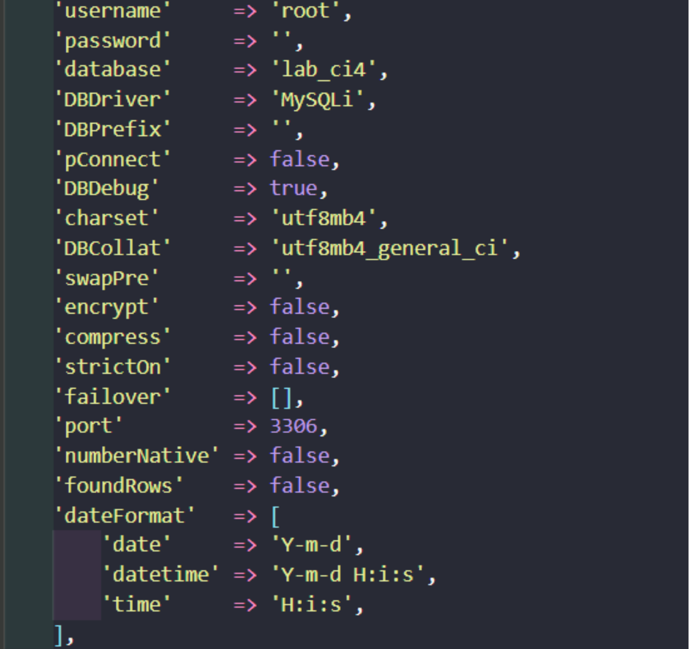
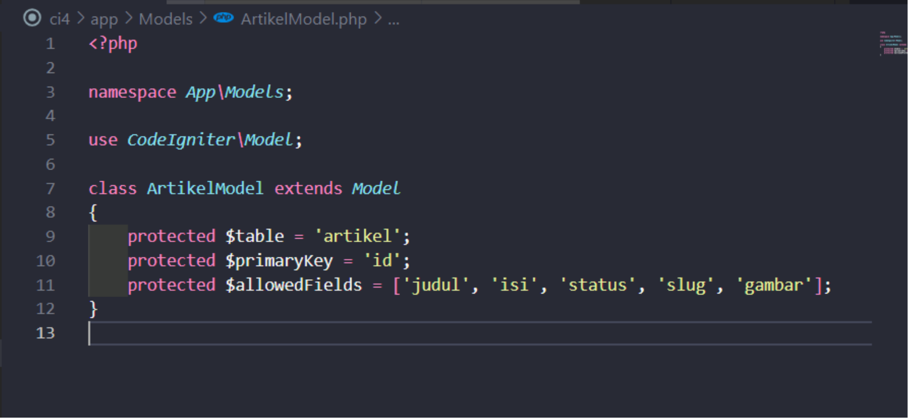
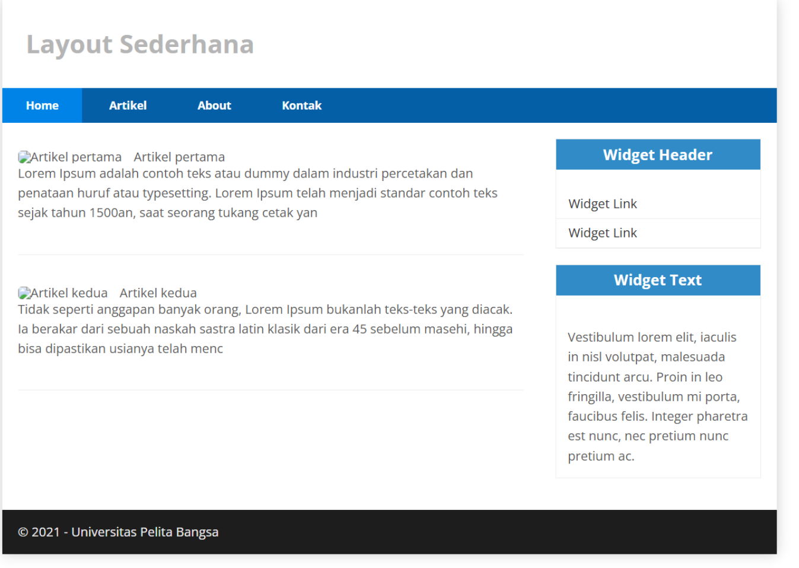
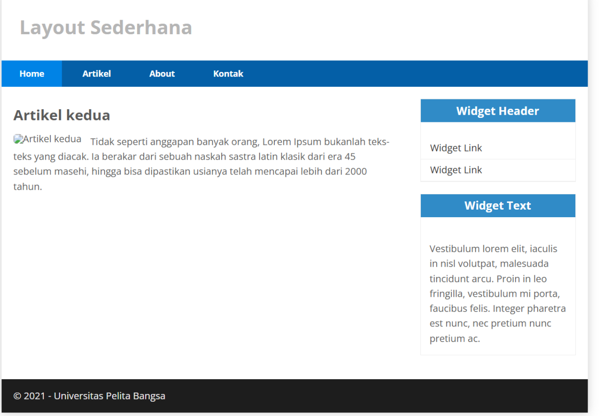
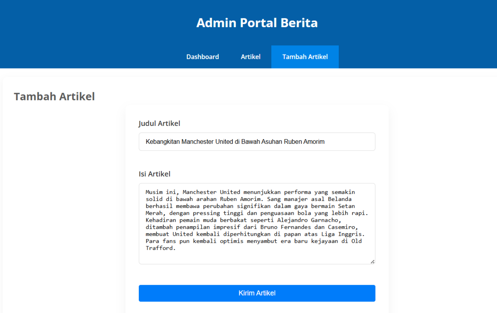
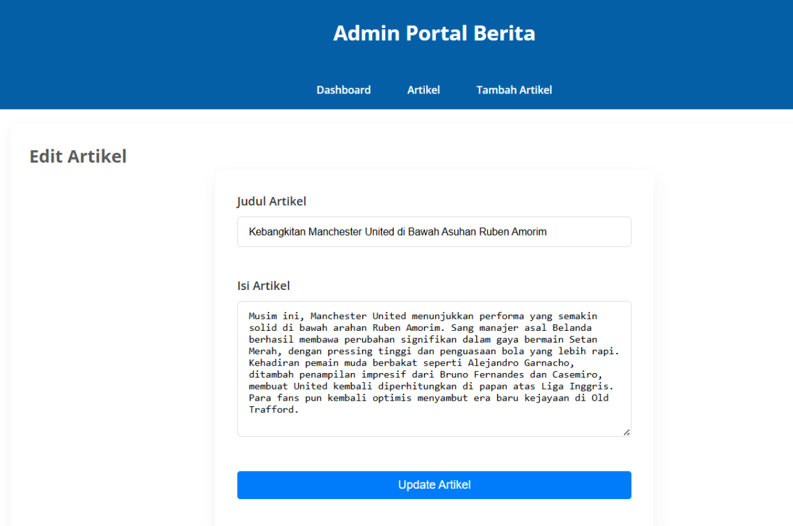

## 👤 Profil Mahasiswa

| Atribut         | Keterangan            |
| --------------- | --------------------- |
| **Nama**        | Ridho Fauzi           |
| **NIM**         | 312310563             |
| **Kelas**       | TI.23.A.5             |
| **Mata Kuliah** | Pemrograman Website 2 |

# Praktikum 1: PHP Framework (CodeIgniter 4)

## Tujuan Praktikum
1. Memahami konsep dasar Framework.
2. Memahami konsep dasar Model-View-Controller (MVC).
3. Mampu membuat program sederhana menggunakan Framework CodeIgniter 4.

---

## Persiapan Lingkungan
### Mengaktifkan Ekstensi PHP
Sebelum menggunakan CodeIgniter, beberapa ekstensi PHP perlu diaktifkan melalui **XAMPP Control Panel**:
- **php-json** (untuk JSON processing)
- **php-mysqlnd** (untuk koneksi MySQL)
- **php-xml** (untuk XML processing)
- **php-intl** (untuk aplikasi multibahasa)
- **libcurl** (opsional untuk Curl)


### Langkah Aktivasi:
1. Buka `php.ini` melalui **XAMPP Control Panel** → Apache → Config → `php.ini`
2. Cari dan hapus tanda `;` pada ekstensi yang disebutkan di atas.
3. Simpan file `php.ini` dan restart Apache.

---


## Instalasi CodeIgniter 4
### Cara Manual:
1. **Unduh CodeIgniter 4** dari [CodeIgniter.com](https://codeigniter.com/download)
2. Ekstrak file zip ke folder `htdocs/lab11_ci`
3. Ubah nama folder `framework-4.x.xx` menjadi `ci4`
4. Jalankan di browser: `http://localhost/lab11_ci/ci4/public/`

---

## Menjalankan Command Line Interface (CLI)
Untuk menggunakan CLI CodeIgniter:
1. Buka terminal dan arahkan ke folder project:  
   ```sh
   cd xampp/htdocs/lab11_ci/ci4/
   ```
2. Jalankan perintah berikut untuk memastikan CLI aktif:
   ```sh
   php spark
   ```

---


## Mengaktifkan Mode Debugging
Untuk mempermudah debugging, ubah mode environment ke **development**:
1. Ubah nama file `.env.example` menjadi `.env`
2. Buka `.env`, cari baris berikut:
   ```sh
   CI_ENVIRONMENT = production
   ```
3. Ubah menjadi:
   ```sh
   CI_ENVIRONMENT = development
   ```

---


## Struktur Direktori CodeIgniter 4
- `app/` → Folder utama tempat kita mengembangkan aplikasi.
- `public/` → Menyimpan aset seperti CSS, gambar, dan JavaScript.
- `writable/` → Menyimpan file sementara seperti logs dan session.
- `vendor/` → Berisi library CodeIgniter.
- `tests/` → Untuk unit testing.

---

## Konsep MVC di CodeIgniter
- **Model** → Mengelola data dan berhubungan dengan database.
- **View** → Mengelola tampilan antarmuka.
- **Controller** → Menghubungkan Model dan View.

---

## Routing dan Controller
Routing mengatur request dan menentukan controller yang menangani request tersebut.
### Contoh Routing di `app/Config/Routes.php`:
```php
$routes->get('/', 'Home::index');
$routes->get('/about', 'Page::about');
$routes->get('/contact', 'Page::contact');
```

**Cek daftar route yang tersedia:**
```sh
php spark routes
```

---

## Membuat Controller
Contoh `app/Controllers/Page.php`:
```php
<?php 
namespace App\Controllers;

class Page extends BaseController 
{
    public function about() 
    {
        echo "Ini halaman About";
    }
    
    public function contact() 
    {
        echo "Ini halaman Contact";
    }
    
    public function faqs() 
    {
        echo "Ini halaman FAQ";
    }
}
```

Coba akses di browser: `http://localhost:8080/about`

---


## Auto Routing
Auto Routing memungkinkan pemetaan controller secara otomatis.
Pastikan Auto Routing aktif di `Routes.php`:
```php
$routes->setAutoRoute(true);
```
Tambahkan method baru di `Page.php`:
```php
public function tos() 
{
    echo "Ini halaman Term of Services";
}
```
Akses di browser: `http://localhost:8080/page/tos`

---

## Membuat View
Buat file `app/Views/about.php`:
```php
<!DOCTYPE html>
<html lang="en">
<head>
    <meta charset="UTF-8">
    <title><?= $title; ?></title>
</head>
<body>
    <h1><?= $title; ?></h1>
    <hr>
    <p><?= $content; ?></p>
</body>
</html>
```
Ubah `Page.php` agar menampilkan View:
```php
public function about() 
{
    return view('about', [
        'title' => 'Halaman About',
        'content' => 'Ini adalah halaman About'
    ]);
}
```

Akses kembali di browser untuk melihat hasilnya.

---

## Membuat Layout dengan CSS
Buat file `public/style.css` dan tambahkan kode layout CSS. Kemudian buat **header dan footer**:
### `app/Views/template/header.php`
```php
<!DOCTYPE html>
<html lang="en">
<head>
    <meta charset="UTF-8">
    <title><?= $title; ?></title>
    <link rel="stylesheet" href="<?= base_url('/style.css');?>">
</head>
<body>
    <div id="container">
    <header>
        <h1>Layout Sederhana</h1>
    </header>
    <nav>
        <a href="<?= base_url('/'); ?>" class="active">Home</a>
        <a href="<?= base_url('/about'); ?>">About</a>
        <a href="<?= base_url('/contact'); ?>">Kontak</a>
    </nav>
    <section id="wrapper">
    <section id="main">
```

### `app/Views/template/footer.php`
```php
        </section>
        <footer>
            <p>&copy; 2024 - Universitas Pelita Bangsa</p>
        </footer>
    </div>
</body>
</html>
```

### Ubah `about.php` agar menggunakan template layout:
```php
<?= $this->include('template/header'); ?>

<h1><?= $title; ?></h1>
<hr>
<p><?= $content; ?></p>

<?= $this->include('template/footer'); ?>
```


Jalankan kembali di browser: `http://localhost:8080/about`

---

## Tugas
1. Lengkapi kode program untuk menu lainnya agar memiliki tampilan layout yang sama.
2. Buat repository **Lab7Web** di GitHub.
3. Kerjakan semua latihan dan screenshot hasilnya.
4. Buat file `README.md` dan tuliskan langkah-langkah praktikum beserta screenshotnya.
5. Commit dan push ke repository GitHub.
6. Kirim URL repository ke e-learning eCampus.

---

**Selamat Mengerjakan!** 🎯


<div align="center">
  
  
</div>

# 📌 Tugas Praktikum 1-3

Dokumen ini berisi laporan tugas untuk praktikum 1 hingga 3 dalam mata kuliah Pemrograman Website 2. Setiap praktikum mencakup konsep dasar hingga implementasi menggunakan framework CodeIgniter 4.

Dalam praktikum ini, mahasiswa diharapkan memahami konsep framework, arsitektur MVC (Model-View-Controller), serta mampu mengembangkan aplikasi web sederhana dengan CodeIgniter 4. Setiap tahap dijelaskan secara rinci mulai dari instalasi, konfigurasi, hingga pengembangan fitur CRUD, routing, serta penggunaan View Layout dan View Cell.

Laporan ini juga dilengkapi dengan screenshot hasil implementasi untuk mendukung pemahaman serta sebagai bukti keberhasilan dalam menyelesaikan setiap langkah praktikum. Dengan menyelesaikan tugas ini, mahasiswa diharapkan mampu membangun aplikasi berbasis web dengan struktur yang lebih terorganisir, efisien, dan modular.

## 🔗 Daftar Isi

| No  | Praktikum                                  | Link                                                     |
| --- | ------------------------------------------ | -------------------------------------------------------- |
| 1   | Praktikum 1: PHP Framework (CodeIgniter 4) | [Klik di sini](#praktikum-1-php-framework-codeigniter-4) |
| 2   | Praktikum 2: Framework Lanjutan (CRUD)     | [Klik di sini](#praktikum-2-framework-lanjutan-crud)     |
| 3   | Praktikum 3: View Layout dan View Cell     | [Klik di sini](#praktikum-3-view-layout-dan-view-cell)   |

## 👤 Profil Mahasiswa

| Atribut         | Keterangan            |
| --------------- | --------------------- |
| **Nama**        | Alvin Alfandy         |
| **NIM**         | 312310473             |
| **Kelas**       | TI.23.A.5             |
| **Mata Kuliah** | Pemrograman Website 2 |

---

# Praktikum 1: PHP Framework (CodeIgniter 4)

## 🎯 Tujuan Praktikum

- Memahami konsep dasar Framework.
- Memahami konsep dasar MVC.
- Membuat program sederhana menggunakan Framework CodeIgniter 4.
- Mengimplementasikan routing dan controller pada CodeIgniter.
- Membuat tampilan dengan View dan Layout menggunakan CSS.

---

## ⚙️ Langkah-Langkah Praktikum

### 📌 1. Persiapan

🔹 Mengaktifkan ekstensi PHP yang dibutuhkan melalui `php.ini`.
🔹 Restart Apache melalui XAMPP Control Panel.

📷 **Screenshot Konfigurasi PHP.ini:**



---

### 📌 2. Instalasi Codeigniter 4

🔹 Download Codeigniter 4 dari [🔗 Situs Resmi Codeigniter](https://codeigniter.com/download).
🔹 Ekstrak ke direktori `htdocs/lab11_ci/`.
🔹 Ubah nama folder menjadi `ci4`.
🔹 Akses `http://localhost/lab11_ci/ci4/public/` untuk memastikan instalasi berhasil.

📷 **Screenshot Tampilan Codeigniter 4:**



---

### 📌 3. Menjalankan CLI (Command Line Interface)

```bash
cd xampp/htdocs/lab11_ci/ci4/
php spark
```

📷 **Screenshot Hasil Perintah CLI:**



---

### 📌 4. Mengaktifkan Mode Debugging

```bash
# Buka file .env dan ubah:
CI_ENVIRONMENT = development
```

📷 **Screenshot Konfigurasi Debugging:**



---

### 📌 5. Membuat Route Baru

Tambahkan kode berikut di `app/config/Routes.php`:

```php
$routes->get('/about', 'Page::about');
$routes->get('/contact', 'Page::contact');
$routes->get('/faqs', 'Page::faqs');
```

```bash
php spark routes
```

📷 **Screenshot CLI & Error Page:**


---

### 📌 6. Membuat Controller Page

Buat file `Page.php` di `app/Controllers/`:

```php
<?php
namespace App\Controllers;
class Page extends BaseController {
    public function about() { echo "Ini halaman About"; }
    public function contact() { echo "Ini halaman Contact"; }
    public function faqs() { echo "Ini halaman FAQ"; }
}
```

📷 **Screenshot Tampilan About Page:**


---

### 📌 7. Membuat View

Buat file `app/Views/about.php`:

```php
<!DOCTYPE html>
<html>
<head>
    <title><?= $title; ?></title>
</head>
<body>
    <h1><?= $title; ?></h1>
    <p><?= $content; ?></p>
</body>
</html>
```

📷 **Screenshot Tampilan View About Page:**


---

### 📌 8. Membuat Layout Web dengan CSS

- Simpan file `style.css` di `public/`
- Buat `header.php` dan `footer.php` di `app/Views/template/`
- Ubah `about.php` agar menggunakan `include`:

```php
<?= $this->include('template/header'); ?>
<h1><?= $title; ?></h1>
<p><?= $content; ?></p>
<?= $this->include('template/footer'); ?>
```

📷 **Screenshot :**


### 📌 9. 🚀 Menambahkan Halaman Baru (Services) dan (Artikel)

Agar website lebih lengkap, kita akan menambahkan halaman `Services` dan `Artikel` pilkan informasi layanan yang disediakan. yang menampilkan informasi layanan yang disediakan.

### Praktikum 2: Framework Lanjutan (CRUD)

🛠 **Langkah 1: Menambahkan Route untuk Halaman Services**
Tambahkan route baru di `app/Config/Routes.php`, sehingga halaman ini dapat diakses melalui URL:

```php
$routes->get('/services', 'Page::services');
```

📝 **Langkah 2: Membuat Method dalam Controller**
Tambahkan method `services()` di `app/Controllers/Page.php` agar controller bisa menghandle request halaman `Services`:

```php
public function services() {
    return view('services', [
        'title' => '💼 Halaman Services',
        'content' => 'Kami menyediakan berbagai layanan, mulai dari konsultasi IT hingga pengembangan software. Hubungi kami untuk informasi lebih lanjut!'
    ]);
}
```

🎨 **Langkah 3: Membuat View untuk Halaman Services**
Buat file baru `app/Views/services.php` dan isi dengan kode berikut untuk tampilan halaman:

```php
<?= $this->include('template/header'); ?>
<h1>🛠 <?= $title; ?></h1>
<p>📌 <?= $content; ?></p>
<?= $this->include('template/footer'); ?>
```

🌐 **Langkah 4: Mengakses Halaman Services**
Setelah semua selesai, buka browser dan akses:

```
http://localhost:8080/services
```

Jika semua sudah berjalan dengan baik, halaman `Services` akan tampil dengan informasi layanan yang tersedia. 🎉

📷 **Screenshot Tampilan Halaman Services:**


Pada langkah ini, kita akan menambahkan halaman baru bernama `Services` agar dapat diakses melalui URL.

## 📄 Menambahkan Halaman Artikel

Karena di navigasi ada menu `Artikel`, kita juga harus membuat halamannya.

🛠 **Langkah 1: Menambahkan Route untuk Halaman Artikel**
Tambahkan kode berikut di `app/Config/Routes.php`:

```php
$routes->get('/artikel', 'Page::artikel');
```

📝 **Langkah 2: Membuat Method dalam Controller**
Tambahkan method `artikel()` di `app/Controllers/Page.php`:

```php
public function artikel() {
    return view('artikel', [
        'title' => '📰 Halaman Artikel',
        'content' => 'Selamat datang di halaman artikel. Di sini Anda dapat membaca berbagai artikel menarik yang kami sajikan.'
    ]);
}
```

🎨 **Langkah 3: Membuat View untuk Halaman Artikel**
Buat file baru `app/Views/artikel.php` dan isi dengan kode berikut:

```php
<?= $this->include('template/header'); ?>
<h1>📰 <?= $title; ?></h1>
<p>📖 <?= $content; ?></p>
<?= $this->include('template/footer'); ?>
```

🌐 **Langkah 4: Mengakses Halaman Artikel**
Setelah semua selesai, buka browser dan akses:

```
http://localhost:8080/artikel
```

Jika semua sudah berjalan dengan baik, halaman `Artikel` akan tampil dengan kontennya. 🎉

📷 **Screenshot Tampilan Halaman Artikel:**


✅ Kesimpulan

Hasil Praktikum
Dari praktikum ini, kita telah memahami dasar-dasar penggunaan framework CodeIgniter 4, termasuk:

Struktur direktori dan konfigurasi awal CodeIgniter.

Mengaktifkan dan mengonfigurasi CodeIgniter 4 untuk pengembangan aplikasi.

Menjalankan aplikasi menggunakan Command Line Interface (CLI).

Membuat dan mengelola routing untuk berbagai halaman dalam website.

Menggunakan Controller dan View untuk menampilkan konten dinamis.

Menerapkan layout dengan template header dan footer.

Menambahkan halaman Services dan Artikel agar website lebih informatif.

✨ Kesimpulan
Dengan menyelesaikan praktikum ini, kita telah mendapatkan wawasan mendalam tentang bagaimana CodeIgniter 4 mempermudah pengembangan aplikasi web. Framework ini menawarkan struktur yang lebih terorganisir, efisien, dan fleksibel, yang sangat membantu dalam membangun aplikasi berbasis web secara lebih profesional. 🚀🔥
Dari praktikum ini, kita telah memahami konsep dasar penggunaan framework CodeIgniter 4, termasuk struktur direktori, konfigurasi awal, serta implementasi konsep MVC (Model-View-Controller). Selain itu, kita juga telah berhasil:

- Mengaktifkan dan mengkonfigurasi CodeIgniter 4.
- Menjalankan aplikasi menggunakan Command Line Interface (CLI).
- Membuat dan mengelola routing untuk halaman-halaman dalam website.
- Membuat Controller dan View untuk menampilkan konten dinamis.
- Mengimplementasikan layout menggunakan template header dan footer.
- Menambahkan halaman Services dan Artikel agar website lebih lengkap.

Dengan menyelesaikan praktikum ini, kita mendapatkan pemahaman yang lebih baik tentang bagaimana CodeIgniter 4 mempermudah pengembangan aplikasi berbasis web dengan struktur yang lebih terorganisir dan efisien. 🚀

# Praktikum 2: Framework Lanjutan (CRUD)

## Tujuan

1. Mahasiswa mampu memahami konsep dasar Model.
2. Mahasiswa mampu memahami konsep dasar CRUD.
3. Mahasaswa mampu membuat program sederhana menggunakan Framework Codeigniter4.

## Persiapan

1. Persiapkan text editor misalnya VSCode.
2. Buka kembali folder dengan nama lab7_php_ci pada docroot webserver (htdocs)
3. Pastikan MySQL Server sudah dapat dijalankan melalui XAMPP.

## Pertanyaan dan Tugas

Selesaikan programnya sesuai Langkah-langkah yang ada. Anda boleh melakukan improvisasi.

## Laporan Praktikum

1. Melanjutkan praktikum sebelumnya pada repository dengan nama Lab7Web.
2. Kerjakan semua latihan yang diberikan sesuai urutannya.
3. Screenshot setiap perubahannya.
4. Update file README.md dan tuliskan penjelasan dari setiap langkah praktikum beserta screenshotnya.
5. Commit hasilnya pada repository masing-masing.
6. Kirim URL repository pada e-learning ecampus

## Langkah-langkah Praktikum

### 1. Membuat Database: Studi Kasus Data Artikel

```sql
CREATE DATABASE lab_ci4;
```

### 2. Membuat Tabel

```sql
CREATE TABLE artikel (
    id INT(11) auto_increment,
    judul VARCHAR(200) NOT NULL,
    isi TEXT,
    gambar VARCHAR(200),
    status TINYINT(1) DEFAULT 0,
    slug VARCHAR(200),
    PRIMARY KEY(id)
);
```


### 3. Konfigurasi koneksi database

Konfigurasi dapat dilakukan dengan du acara, yaitu pada file app/config/database.php atau menggunakan file .env. Pada praktikum ini kita gunakan konfigurasi pada file .env.


### 4. Membuat Model

Buat file baru pada direktori app/Models dengan nama ArtikelModel.php

```php
<?php
namespace App\Models;
use CodeIgniter\Model;

class ArtikelModel extends Model
{
    protected $table = 'artikel';
    protected $primaryKey = 'id';
    protected $useAutoIncrement = true;
    protected $allowedFields = ['judul', 'isi', 'status', 'slug', 'gambar'];
}
```


### 5. Membuat Controller

Buat Controller baru dengan nama Artikel.php pada direktori app/Controllers.

```php
<?php
namespace App\Controllers;
use App\Models\ArtikelModel;

class Artikel extends BaseController
{
    public function index()
    {
        $title = 'Daftar Artikel';
        $model = new ArtikelModel();
        $artikel = $model->findAll();
        return view('artikel/index', compact('artikel', 'title'));
    }
}
```


### 6. Membuat View

Buat direktori baru dengan nama artikel pada direktori app/views, kemudian buat file baru dengan nama index.php.

```php
<?= $this->include('template/header'); ?>

<?php if($artikel): foreach($artikel as $row): ?>
<article class="entry">
    <h2><a href="<?= base_url('/artikel/' . $row['slug']);?>"><?= $row['judul']; ?></a></h2>
    " alt="<?= $row['judul']; ?>">
    <p><?= substr($row['isi'], 0, 200); ?></p>
</article>
<hr class="divider" />
<?php endforeach; else: ?>
<article class="entry">
    <h2>Belum ada data.</h2>
</article>
<?php endif; ?>

<?= $this->include('template/footer'); ?>
```


### 7. Akses dengan browser

Selanjutnya buka browser kembali, dengan mengakses url http://localhost:8080/artikel


### 8. Menambahkan Data Artikel

Belum ada data yang ditampilkan. Kemudian coba tambahkan beberapa data pada database agar dapat ditampilkan datanya.

```sql
INSERT INTO artikel (judul, isi, slug) VALUE
('Artikel pertama', 'Lorem Ipsum adalah contoh teks atau dummy dalam industri percetakan dan penataan huruf atau typesetting. Lorem Ipsum telah menjadi standar contoh teks sejak tahun 1500an, saat seorang tukang cetak yang tidak dikenal mengambil sebuah kumpulan teks dan mengacaknya untuk menjadi sebuah buku contoh huruf.', 'artikel-pertama'),
('Artikel kedua', 'Tidak seperti anggapan banyak orang, Lorem Ipsum bukanlah teks-teks yang diacak. Ia berakar dari sebuah naskah sastra latin klasik dari era 45 sebelum masehi, hingga bisa dipastikan usianya telah mencapai lebih dari 2000 tahun.', 'artikel-kedua');
```



### 9. Membuat Tampilan Detail Artikel

Tambahkan fungsi baru pada Controller Artikel dengan nama view().

```php
public function view($slug)
{
    $model = new ArtikelModel();
    $artikel = $model->where([
        'slug' => $slug
    ])->first();

    // Menampilkan error apabila data tidak ada.
    if (!$artikel)
    {
        throw PageNotFoundException::forPageNotFound();
    }

    $title = $artikel['judul'];
    return view('artikel/detail', compact('artikel', 'title'));
}
```

### 10. Membuat View Detail

Buat view baru untuk halaman detail dengan nama app/views/artikel/detail.php.

```php
<?= $this->include('template/header'); ?>

<article class="entry">
    <h2><?= $artikel['judul']; ?></h2>
    " alt="<?= $artikel['judul']; ?>">
    <p><?= $row['isi']; ?></p>
</article>

<?= $this->include('template/footer'); ?>
```

### 11. Membuat Routing untuk artikel detail

Buka Kembali file app/config/Routes.php, kemudian tambahkan routing untuk artikel detail.

```php
$routes->get('/artikel/(:any)', 'Artikel::view/$1');
```



### 12. Membuat Menu Admin

Menu admin adalah untuk proses CRUD data artikel. Buat method baru pada Controller Artikel dengan nama admin_index().

```php
public function admin_index()
{
    $title = 'Daftar Artikel';
    $model = new ArtikelModel();
    $artikel = $model->findAll();
    return view('artikel/admin_index', compact('artikel', 'title'));
}
```

### 13. Membuat View Admin

Selanjutnya buat view untuk tampilan admin dengan nama admin_index.php

```php
<?= $this->include('template/admin_header'); ?>

<table class="table">
    <thead>
        <tr>
            <th>ID</th>
            <th>Judul</th>
            <th>Status</th>
            <th>AKsi</th>
        </tr>
    </thead>
    <tbody>
        <?php if($artikel): foreach($artikel as $row): ?>
        <tr>
            <td><?= $row['id']; ?></td>
            <td>
                <b><?= $row['judul']; ?></b>
                <p><small><?= substr($row['isi'], 0, 50); ?></small></p>
            </td>
            <td><?= $row['status']; ?></td>
            <td>
                <a class="btn" href="<?= base_url('/admin/artikel/edit/' . $row['id']);?>">Ubah</a>
                <a class="btn btn-danger" onclick="return confirm('Yakin menghapus data?');" href="<?= base_url('/admin/artikel/delete/' . $row['id']);?>">Hapus</a>
            </td>
        </tr>
        <?php endforeach; else: ?>
        <tr>
            <td colspan="4">Belum ada data.</td>
        </tr>
        <?php endif; ?>
    </tbody>
    <tfoot>
        <tr>
            <th>ID</th>
            <th>Judul</th>
            <th>Status</th>
            <th>AKsi</th>
        </tr>
    </tfoot>
</table>

<?= $this->include('template/admin_footer'); ?>
```

### 14. Menambahkan Routing untuk Menu Admin

Tambahkan routing untuk menu admin seperti berikut:

```php
$routes->group('admin', function($routes) {
    $routes->get('artikel', 'Artikel::admin_index');
    $routes->add('artikel/add', 'Artikel::add');
    $routes->add('artikel/edit/(:any)', 'Artikel::edit/$1');
    $routes->get('artikel/delete/(:any)', 'Artikel::delete/$1');
});
```

Akses menu admin dengan url http://localhost:8080/admin/artikel


### 15. Menambah Data Artikel

Tambahkan fungsi/method baru pada Controller Artikel dengan nama add().

```php
public function add()
{
    // validasi data.
    $validation = \Config\Services::validation();
    $validation->setRules(['judul' => 'required']);
    $isDataValid = $validation->withRequest($this->request)->run();

    if ($isDataValid)
    {
        $artikel = new ArtikelModel();
        $artikel->insert([
            'judul' => $this->request->getPost('judul'),
            'isi' => $this->request->getPost('isi'),
            'slug' => url_title($this->request->getPost('judul')),
        ]);
        return redirect('admin/artikel');
    }

    $title = "Tambah Artikel";
    return view('artikel/form_add', compact('title'));
}
```

### 16. Membuat View Form Tambah

Kemudian buat view untuk form tambah dengan nama form_add.php

```php
<?= $this->include('template/admin_header'); ?>

<h2><?= $title; ?></h2>
<form action="" method="post">
    <p>
        <input type="text" name="judul">
    </p>
    <p>
        <textarea name="isi" cols="50" rows="10"></textarea>
    </p>
    <p><input type="submit" value="Kirim" class="btn btn-large"></p>
</form>

<?= $this->include('template/admin_footer'); ?>
```



### 17. Mengubah Data

Tambahkan fungsi/method baru pada Controller Artikel dengan nama edit().

```php
public function edit($id)
{
    $artikel = new ArtikelModel();
    // validasi data.
    $validation = \Config\Services::validation();
    $validation->setRules(['judul' => 'required']);
    $isDataValid = $validation->withRequest($this->request)->run();

    if ($isDataValid)
    {
        $artikel->update($id, [
            'judul' => $this->request->getPost('judul'),
            'isi' => $this->request->getPost('isi'),
        ]);
        return redirect('admin/artikel');
    }

    // ambil data lama
    $data = $artikel->where('id', $id)->first();
    $title = "Edit Artikel";
    return view('artikel/form_edit', compact('title', 'data'));
}
```

### 18. Membuat View Form Edit

Kemudian buat view untuk form tambah dengan nama form_edit.php

```php
<?= $this->include('template/admin_header'); ?>

<h2><?= $title; ?></h2>
<form action="" method="post">
    <p>
        <input type="text" name="judul" value="<?= $data['judul'];?>" >
    </p>
    <p>
        <textarea name="isi" cols="50" rows="10"><?= $data['isi'];?></textarea>
    </p>
    <p><input type="submit" value="Kirim" class="btn btn-large"></p>
</form>

<?= $this->include('template/admin_footer'); ?>
```



### 19. Menghapus Data

Tambahkan fungsi/method baru pada Controller Artikel dengan nama delete().

```php
public function delete($id)
{
    $artikel = new ArtikelModel();
    $artikel->delete($id);
    return redirect('admin/artikel');
}
```

